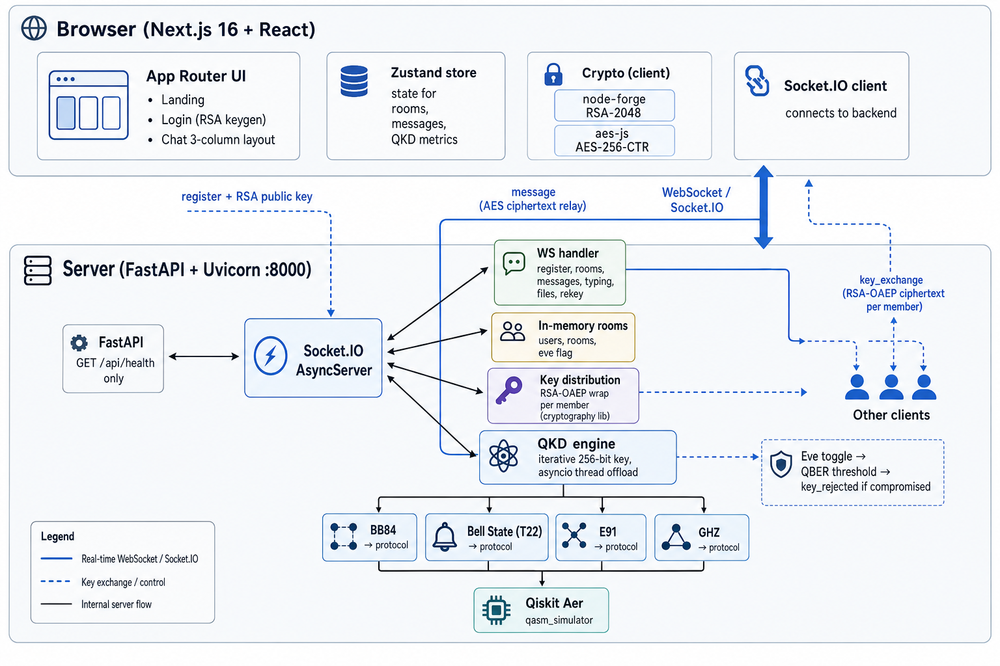

# Entangl — Quantum-Secured Multi-Party Chat

A real-time encrypted chat application that uses **Quantum Key Distribution (QKD)** to generate cryptographic keys, with **live eavesdropper detection** that demonstrates quantum security principles in action.

Built with Next.js 16, React 19, FastAPI, Socket.IO, and IBM Qiskit.

## Table of Contents

- [Features](#features)
- [Architecture](#architecture)
- [Getting Started](#getting-started)
- [QKD Protocols](#qkd-protocols)
  - [BB84](#bb84-protocol)
  - [Bell State (T22)](#bell-state-t22-protocol)
  - [E91](#e91-protocol)
  - [CASQKA (Multi-Party)](#casqka-multi-party-protocol)
- [Security Model](#security-model)
- [Eavesdropper Simulation](#eavesdropper-simulation)
- [Quantum Dashboard](#quantum-dashboard)
- [Tech Stack](#tech-stack)
- [Project Structure](#project-structure)
- [Socket.IO Events](#socketio-events)

---

## Features

- **Quantum Key Distribution** — 4 QKD protocols (BB84, Bell State T22, E91, CASQKA) generate 256-bit symmetric keys via Qiskit quantum circuit simulation
- **End-to-End Encryption** — Messages encrypted with AES-256-CTR using QKD-derived keys; key exchange protected by RSA-2048 OAEP
- **Real-Time Chat** — Socket.IO bidirectional communication with typing indicators, online presence, and instant message delivery
- **Multi-Party Rooms** — Create rooms with 2+ members; CASQKA protocol auto-selected for 3+ party quantum key agreement
- **Eavesdropper Detection** — Toggle a simulated Eve to inject measurement attacks into the quantum channel; watch QBER spike and keys get rejected in real time
---

## Architecture



**Data Flow for Sending a Message:**

1. Sender types message → AES-256-CTR encrypt with room's QKD key (random nonce per message)
2. Encrypted ciphertext (`nonce:ciphertext` hex format) sent via Socket.IO `message` event
3. Server relays to all room members (except sender)
4. Recipients decrypt locally using their copy of the same QKD-derived key

**Data Flow for Key Exchange:**

1. Room created → server triggers QKD protocol via `asyncio.to_thread()`
2. Qiskit simulates quantum circuits → iterative rounds until 256 bits accumulated
3. If QBER exceeds threshold → key rejected, channel marked compromised
4. If QBER acceptable → 256-bit binary key encrypted per-member with RSA-2048 OAEP
5. Each member decrypts their copy with their private RSA key → shared symmetric key established

---

## Getting Started

### Prerequisites

- **Node.js** >= 18
- **Python** >= 3.10
- **pip** (Python package manager)

### Backend Setup

```bash
cd backend
pip install -r requirements.txt
python main.py
```

The server starts on `http://localhost:8000`. Health check: `GET /api/health`.

> **Note:** First run may take longer as Qiskit downloads and caches the `qasm_simulator` backend.

**Python Dependencies:**

| Package | Purpose |
|---------|---------|
| `fastapi` | REST framework (health check endpoint) |
| `uvicorn` | ASGI server |
| `python-socketio` | Async Socket.IO for real-time events |
| `qiskit` >= 1.0 | Quantum circuit construction and transpilation |
| `qiskit-aer` | Quantum circuit simulator (`qasm_simulator`) |
| `numpy` | Numerical operations for QKD measurements |
| `cryptography` | RSA-2048 OAEP encryption for key distribution |
| `pydantic` | Data model documentation |

### Frontend Setup

```bash
cd frontend
npm install
npm run dev
```

The app opens at `http://localhost:3000`.

**Environment:** No `.env` file required. The Socket.IO client connects to `localhost:8000` by default (configured in `lib/socket.ts`).

### Quick Start

1. Start the backend (`python main.py`)
2. Start the frontend (`npm run dev`)
3. Open two browser tabs at `http://localhost:3000`
4. Enter different nicknames on each tab → RSA-2048 keys generated automatically
5. Create a room, select members and a QKD protocol
6. Watch the Quantum Dashboard as key exchange completes
7. Start chatting — all messages are encrypted with the QKD-derived key

---

## QKD Protocols

All protocols generate **256-bit symmetric keys** through iterative rounds of quantum circuit simulation. Each round produces a partial key; rounds continue until 256 bits are accumulated. If the Quantum Bit Error Rate (QBER) exceeds the protocol's threshold during any round, the key is rejected and the channel is flagged as compromised.

### Protocol Comparison

| Protocol | Speed | QBER Threshold | Round Size | Sifting Efficiency | Parties | Circuit Batching |
|----------|-------|---------------|------------|-------------------|---------|-----------------|
| **BB84** | ~0.9s | 8% | 64 qubits | ~50% | 2 | Yes |
| **Bell State** | ~3.4s | 15% | 128 trials | ~8.3% | 2 | Yes |
| **E91** | ~4.8s | 8% | 256 combos | ~22% | 2 | Yes |
| **CASQKA** | ~24s | 8% | 64 trials | Variable | 3+ | No |

---

### BB84 Protocol

The fastest protocol, based on Bennett and Brassard's 1984 paper. Uses **single qubits encoded in random bases**.

**How it works:**

1. **Encoding** — Alice prepares each qubit in one of two bases:
   - Rectilinear (Z): `|0⟩` or `|1⟩`
   - Diagonal (X): `|+⟩ = (|0⟩+|1⟩)/√2` or `|−⟩ = (|0⟩−|1⟩)/√2`

2. **Measurement** — Bob independently chooses a random basis and measures each qubit

3. **Sifting** — Alice and Bob publicly compare bases (not values). Only qubits where both chose the **same basis** are kept → ~50% survival rate

4. **QBER Check** — Error rate calculated from sifted bits. If Alice sent `|0⟩` in Z-basis and Bob measured in Z-basis, he should always get `0`. Errors indicate eavesdropping.

**Why eavesdropping is detectable:**

An eavesdropper (Eve) must measure each qubit to learn its value, but she doesn't know which basis Alice used. If Eve guesses wrong (~50% of the time), her measurement collapses the qubit into the wrong basis, introducing a ~25% error rate in the sifted key — well above the 8% threshold.

**Circuit (per qubit):**
```
Alice's encoding:
  Bit=0, Basis=Z: |0⟩         (no gates)
  Bit=1, Basis=Z: X|0⟩ = |1⟩
  Bit=0, Basis=X: H|0⟩ = |+⟩
  Bit=1, Basis=X: XH|0⟩ = |−⟩

Bob's measurement:
  Basis=Z: measure directly
  Basis=X: H then measure
```

---

### Bell State (T22) Protocol

Uses **entangled 4-qubit systems** (two Bell pairs) for a teleportation-based key exchange.

**How it works:**

1. **State Preparation** — Alice creates two Bell pairs from 4 qubits, choosing a random pairing configuration and one of four Bell states:
   - `|Φ⁺⟩ = (|00⟩ + |11⟩)/√2`
   - `|Φ⁻⟩ = (|00⟩ − |11⟩)/√2`
   - `|Ψ⁺⟩ = (|01⟩ + |10⟩)/√2`
   - `|Ψ⁻⟩ = (|01⟩ − |10⟩)/√2`

2. **Reverse Measurement** — Bob independently picks a random pairing and Bell state, then applies the **reverse** Bell circuit

3. **Fidelity Check** — Each trial runs 128 shots. The fraction of outcomes yielding `|0000⟩` is the fidelity. If fidelity > 0.5, it means Bob guessed Alice's configuration correctly.

4. **Key Extraction** — For correct guesses, Alice's group code (2 bits) becomes part of the key

**Why it's secure:**

Eve's measurement collapses the entangled state, dropping fidelity from ~1.0 to ~0.22 — far below the 0.5 matching threshold. QBER jumps to ~78%, dramatically exceeding the 15% limit.

**Key yield:** Only ~1 in 12 trials match (3 pairings × 4 states), so 128 trials per round yield ~10 usable bits.

---

### E91 Protocol

Based on Ekert's 1991 protocol using **singlet-state entangled pairs** and Bell's inequality.

**How it works:**

1. **Singlet State** — Each pair is prepared in `|ψ⁻⟩ = (|01⟩ − |10⟩)/√2` — qubits are **anti-correlated** (if Alice gets 0, Bob gets 1)

2. **Random Bases** — Alice chooses from 3 bases (X, W, Z) and Bob from 3 bases (W, Z, V), where W = π/8 rotation and V = -π/8 rotation

3. **Sifting** — Only basis combinations A2-B1 (W-W) and A3-B2 (Z-Z) produce key bits. Other combinations can verify Bell's inequality.

4. **Anti-Correlation Key** — In matching bases, `alice ≠ bob` confirms correct anti-correlation → Alice's bit becomes the key bit. `alice == bob` is an error.

**Why it's secure:**

The singlet state's perfect anti-correlation is fragile. Eve's intercept-resend attack (measuring in a random basis) introduces ~25% correlation errors, pushing QBER well above the 8% threshold.

**Batch optimization:** Instead of running 256 individual circuits, the engine groups by basis combination (up to 9 unique combos) and runs each with proportional shot counts.

---

### CASQKA Multi-Party Protocol

The only protocol supporting **3+ party** key agreement, using Greenberger-Horne-Zeilinger entangled states.

**How it works:**

1. **CASQKA State** — Creates an N-qubit maximally entangled state:
   ```
   |CASQKA_N⟩ = (|00...0⟩ + |11...1⟩) / √2
   ```
   All qubits are perfectly correlated — measuring any one collapses all others to the same value.

2. **Basis Selection** — Each party independently chooses Z-basis or X-basis. Key bits are only extracted when **all N parties choose the same basis**.

3. **Verification:**
   - Z-basis: all measurements should be identical → disagreement is an error
   - X-basis: parity must be even (XOR of all bits = 0) → odd parity is an error

**Why it's secure:**

Eve's measurement on any single qubit in the CASQKA chain breaks the N-party correlation. Even a single-qubit eavesdrop introduces detectable errors across the entire group.

**Performance note:** CASQKA is ~25x slower than BB84 because it transpiles and runs each circuit individually (no batching). This is a known limitation — each of 64 trials requires a separate transpile + simulate cycle.

**Auto-selection:** When creating a room with 3+ members, the backend automatically selects CASQKA regardless of the user's protocol choice.

---

## Security Model

### Encryption Layers

```
Layer 1: Quantum Key Distribution
  └─ Qiskit qasm_simulator generates 256-bit key via quantum protocols
  └─ QBER threshold enforcement rejects compromised keys

Layer 2: RSA-2048 OAEP Key Transport
  └─ Each member's QKD key is encrypted with their RSA public key
  └─ SHA-256 hash + SHA-256 MGF1 padding
  └─ Keys generated client-side (browser) — server never sees private keys

Layer 3: AES-256-CTR Message Encryption
  └─ Each message encrypted with unique random 16-byte nonce
  └─ Format: hex(nonce):hex(ciphertext)
  └─ Encryption/decryption happens entirely in the browser
```

### Key Properties

| Property | Implementation |
|----------|---------------|
| **Key Generation** | Quantum simulation (not pseudo-random) via Qiskit |
| **Key Length** | 256 bits (all protocols) |
| **Key Transport** | RSA-2048 OAEP per-member encryption |
| **Message Encryption** | AES-256-CTR with random nonce per message |
| **Forward Secrecy** | Manual rekey generates fresh quantum key |
| **Client-Side Crypto** | RSA keygen + AES encrypt/decrypt run in browser |
| **Server Knowledge** | Server never sees plaintext messages or AES keys |

### Threat Model

- **Eavesdropper on quantum channel** → Detected via QBER exceeding threshold; key rejected
- **Man-in-the-middle on classical channel** → RSA-2048 OAEP protects key transport
- **Compromised server** → Server only sees RSA-encrypted keys and AES-encrypted messages
- **Replay attacks** → Random nonce per message prevents ciphertext reuse

---

## Eavesdropper Simulation

The eavesdropper (Eve) toggle in the Quantum Dashboard injects a **measurement attack** into the quantum channel during key generation:

### What Eve Does (Per Protocol)

| Protocol | Eve's Attack | Effect |
|----------|-------------|--------|
| **BB84** | Measures each qubit in a random basis, re-sends | ~25% QBER (threshold: 8%) |
| **Bell State** | Measures random qubits, causing decoherence | ~78% QBER (threshold: 15%) |
| **E91** | Intercept-resend on Bob's qubit | ~25% QBER (threshold: 8%) |
| **CASQKA** | Measures one random qubit in the CASQKA chain | ~12.5% QBER (threshold: 8%) |

### Detection Flow

1. User toggles Eve ON in the Quantum Dashboard
2. Next key generation includes Eve's measurement in circuits
3. QBER spikes above protocol threshold
4. Server emits `key_rejected` with QBER and reason
5. Channel marked **compromised** — red alert banner appears
6. Eve auto-disabled after detection
7. User clicks "Secure Channel" → triggers rekey without Eve → clean key generated

This demonstrates the fundamental quantum security principle: **measuring a quantum state disturbs it**, making eavesdropping inherently detectable.

---

## Quantum Dashboard

The right panel provides real-time visibility into quantum security operations:

### QBER Gauge
- Semicircular SVG gauge showing current Quantum Bit Error Rate (0–25% range)
- Color-coded status: **Secure** (green, ≤5%) → **Warning** (amber, 5–11%) → **Compromised** (red, >11%)
- Threshold tick marks at 5% and 11%

### Key Timeline
- Chronological list of all key exchange events
- Each entry shows: status (accepted/rejected), protocol, QBER percentage, generation time
- Rejected keys show the specific reason

### Protocol Comparison
- Horizontal bar charts comparing average QBER and generation time across protocols
- Only includes accepted key exchanges
- Color-coded per protocol (purple/blue/green/orange)

### Eavesdropper Controls
- Toggle switch to enable/disable Eve
- Shield status indicator (secure/compromised)
- "Rekey Now" button for manual key regeneration
- Compromised banner with detailed explanation and "Secure Channel" action

---

## Tech Stack

### Frontend

| Technology | Version | Purpose |
|-----------|---------|---------|
| Next.js | 16.1.6 | App Router, SSR, file-based routing |
| React | 19.2.3 | UI components |
| TypeScript | 5.x | Type safety |
| Tailwind CSS | 4.x | Utility-first styling (CSS-based config) |
| shadcn/ui | 4.x | 55 pre-built accessible components (radix-vega style) |
| Zustand | 5.x | Client-side state management |
| Socket.IO Client | 4.8.3 | Real-time WebSocket communication |
| node-forge | 1.3.3 | RSA-2048 key generation and OAEP decryption |
| aes-js | 3.1.2 | AES-256-CTR encryption/decryption |
| Framer Motion | 12.x | Component animations |
| GSAP | 3.14.x | Landing page scroll animations |
| Recharts | 2.15.x | Protocol comparison charts |
| Lenis | 1.3.x | Smooth scrolling |
| Sonner | 2.x | Toast notifications |
| Lucide React | 0.577.x | Icons |

### Backend

| Technology | Version | Purpose |
|-----------|---------|---------|
| Python | 3.10+ | Runtime |
| FastAPI | 0.115+ | REST framework (health endpoint) |
| Uvicorn | 0.34+ | ASGI server |
| python-socketio | 5.12+ | Async Socket.IO event handling |
| Qiskit | 1.0+ | Quantum circuit construction and transpilation |
| Qiskit Aer | 0.15+ | Quantum circuit simulation (`qasm_simulator`) |
| NumPy | 1.26+ | Numerical operations for QKD |
| cryptography | 44.0+ | RSA-OAEP key encryption |
| Pydantic | 2.10+ | Schema documentation |

---

## Project Structure

```
quantum-entangl/
├── README.md
├── frontend/                          # Next.js 16 App Router
│   ├── app/
│   │   ├── page.tsx                   # Landing page (GSAP animations, QKD visualization)
│   │   ├── layout.tsx                 # Root layout (ThemeProvider, Toaster)
│   │   ├── globals.css                # Tailwind v4 + shadcn + monolith theme
│   │   ├── login/page.tsx             # Nickname entry + RSA keygen
│   │   └── chat/page.tsx              # Three-column chat layout
│   ├── components/
│   │   ├── chat/
│   │   │   ├── Sidebar.tsx            # Room list, create room, online users, encryption logs
│   │   │   ├── ChatHeader.tsx         # Room info, protocol badge, member list
│   │   │   ├── MessageList.tsx        # Messages, read receipts, file previews, pagination
│   │   │   └── MessageInput.tsx       # Text input, file upload, typing indicator
│   │   ├── quantum/
│   │   │   ├── QuantumDashboard.tsx   # Main dashboard container
│   │   │   ├── QBERGauge.tsx          # SVG semicircular QBER gauge
│   │   │   ├── KeyTimeline.tsx        # Key exchange event history
│   │   │   ├── ProtocolCompare.tsx    # Recharts bar charts
│   │   │   ├── EavesdropperToggle.tsx # Eve controls + rekey button
│   │   │   └── CompromisedBanner.tsx  # Red alert when channel compromised
│   │   └── ui/                        # 55 shadcn v4 components
│   ├── hooks/
│   │   ├── use-socket.tsx             # Core Socket.IO hook (24+ events, custom toasts)
│   │   └── use-mobile.ts             # Mobile detection (shadcn sidebar)
│   ├── lib/
│   │   ├── encryption.ts             # RSA keygen, OAEP decrypt, AES-256-CTR encrypt/decrypt
│   │   ├── socket.ts                 # Socket.IO client singleton
│   │   ├── store.ts                  # Zustand store (auth, rooms, messages, QKD state, files)
│   │   ├── types.ts                  # TypeScript interfaces
│   │   └── utils.ts                  # Tailwind cn() helper
│   └── types/
│       └── aes-js.d.ts               # Type declarations for aes-js
│
└── backend/                           # Python FastAPI + Socket.IO
    ├── main.py                        # Entry point (uvicorn on port 8000)
    ├── requirements.txt               # Python dependencies
    └── app/
        ├── server.py                  # FastAPI + Socket.IO ASGI setup
        ├── api/                       # (empty — no REST routes beyond /api/health)
        ├── ws/
        │   ├── handler.py             # 16 Socket.IO event handlers
        │   ├── rooms.py               # In-memory user/room state management
        │   └── key_distribution.py    # RSA-OAEP encryption + QKD orchestration
        ├── qkd/
        │   ├── engine.py              # Iterative key generation engine
        │   ├── bb84.py                # BB84 single-qubit protocol
        │   ├── bell_state.py          # Bell State T22 entangled 4-qubit protocol
        │   ├── e91.py                 # E91 singlet-state protocol
        │   └── casqka.py              # CASQKA multi-party entanglement protocol
        └── models/
            └── schemas.py             # Pydantic schemas (documentation only)
```
